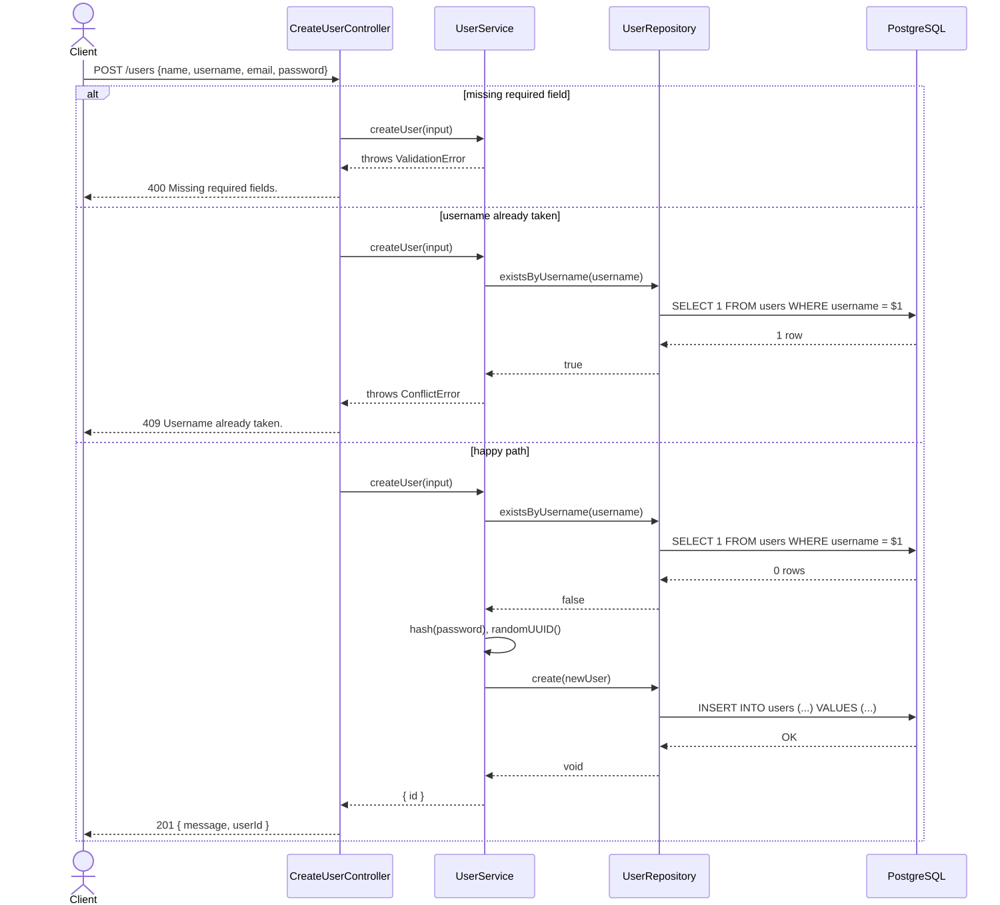
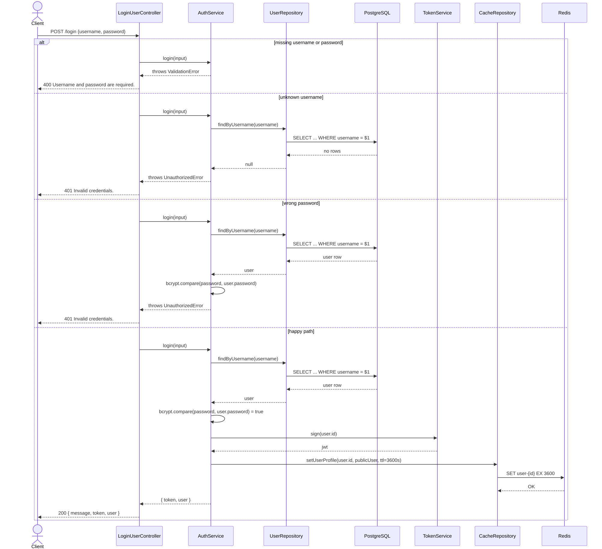
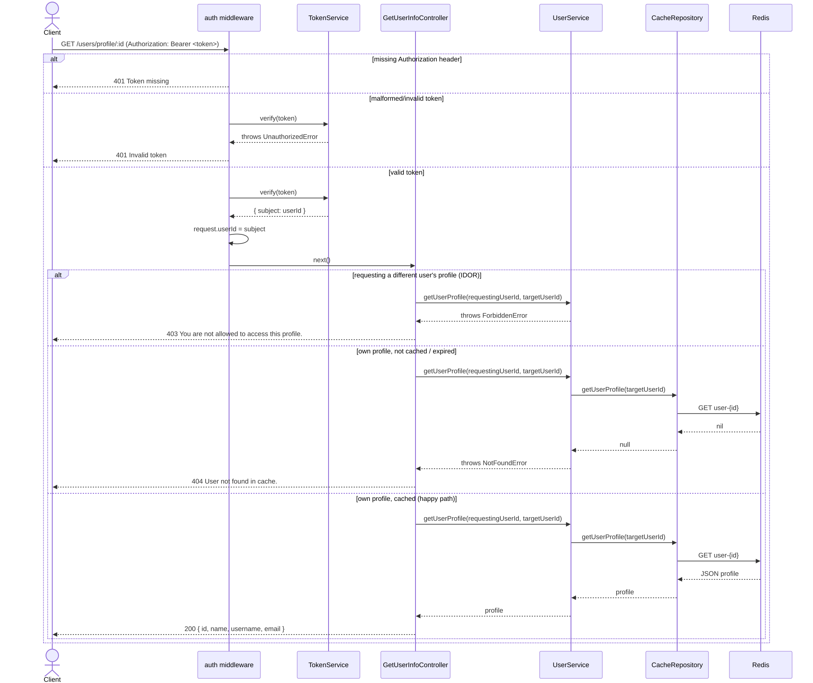

# Node.js + Redis + PostgreSQL REST API

A REST API built with Node.js, Express, PostgreSQL, and Redis that handles user registration, authentication with JWT, and Redis-based profile caching. Built with a layered architecture (controllers → services → repositories), constructor-based dependency injection from a single composition root, centralized error handling, and full unit/integration/e2e/collection test coverage.

---

## Tech Stack

| Layer | Technology |
|---|---|
| Runtime | Node.js 20 + TypeScript 5.9 (strict mode) |
| Framework | Express 5 |
| Database | PostgreSQL 15 (persistent storage) |
| Cache | Redis 7 (session cache via ioredis 6) |
| Auth | JWT (jsonwebtoken) |
| Passwords | bcryptjs 3 |
| API docs | OpenAPI 3.0 via swagger-ui-express |
| Testing | Jest 30 + ts-jest + Supertest (unit, integration, e2e) + Newman (Postman collection) |
| Containers | Docker (multi-stage) + Docker Compose |

> **Dependency note:** TypeScript is pinned to the `5.x` line on purpose. TypeScript 7 (the new Go-based native compiler) and TypeScript 6 are both out — but `@typescript-eslint` doesn't support them yet, and TS 6.0.3 has a regression where `@types/jest` globals (`describe`, `it`, `expect`, ...) stop resolving via `typeRoots`. `5.9.3` is the newest version compatible with the rest of the toolchain. Revisit this pin once `@typescript-eslint` catches up.

---

## Architecture Overview



```
Client
  │
  ▼
Express Router (composition root: routes.ts)
  │
  ├── POST /users              → CreateUserController → UserService   → UserRepository (PostgreSQL)
  ├── POST /login               → LoginUserController  → AuthService    → UserRepository + CacheRepository + TokenService
  └── GET  /users/profile/:id   → auth middleware → GetUserInfoController → UserService → CacheRepository (Redis)
```

Controllers are thin: `asyncHandler` (`src/middleware/asyncHandler.ts`) wraps each `handle` method and forwards any rejected promise to the central `errorHandler` middleware via `next(error)`, so controllers never repeat try/catch boilerplate. All business rules (validation, password hashing, ownership checks, caching) live in the service layer; repositories only wrap raw PostgreSQL/Redis calls.

Every collaborator — repositories, services, controllers, and the auth middleware (built by the `createAuthMiddleware` factory) — is constructed once in `src/routes.ts`, the single composition root, and injected via constructors. Nothing under `src/` reaches into a global singleton or instantiates its own dependencies.

After a successful login, the user's data is stored in Redis with a 1-hour TTL (`user-{id}`). `GET /users/profile/:id` reads exclusively from the Redis cache — no database round-trip — and only succeeds if the authenticated caller (`request.userId`, from the JWT) matches the requested `:id`; otherwise it returns `403`.

See [`docs/`](docs/) for the full set of architecture and sequence diagrams (Mermaid source + rendered SVGs).

---

## API Endpoints

Full interactive documentation (OpenAPI/Swagger UI) is served at **`/docs`** once the server is running.

### `POST /users` — Create a new user



**Request body:**
```json
{
  "name": "newname",
  "username": "newuser",
  "email": "newuser@example.com",
  "password": "newpassword"
}
```

**Responses:**

| Status | Body |
|---|---|
| `201 Created` | `{ "message": "User created successfully", "userId": "<uuid>" }` |
| `400 Bad Request` | `{ "error": "Missing required fields." }` |
| `409 Conflict` | `{ "error": "Username already taken." }` |
| `500 Internal Server Error` | `{ "error": "Internal server error." }` |

---

### `POST /login` — Authenticate a user



**Request body:**
```json
{
  "username": "newuser",
  "password": "newpassword"
}
```

**Responses:**

| Status | Body |
|---|---|
| `200 OK` | `{ "message": "Login successful", "token": "<jwt>", "user": { "id", "name", "username", "email" } }` |
| `400 Bad Request` | `{ "error": "Username and password are required." }` |
| `401 Unauthorized` | `{ "error": "Invalid credentials." }` |
| `500 Internal Server Error` | `{ "error": "Internal server error." }` |

---

### `GET /users/profile/:id` — Get user profile (requires JWT)



**Header:**
```
Authorization: Bearer <token>
```

**Responses:**

| Status | Body |
|---|---|
| `200 OK` | `{ "id", "name", "username", "email" }` |
| `401 Unauthorized` | `{ "error": "Token missing" }` or `{ "error": "Invalid token" }` |
| `403 Forbidden` | `{ "error": "You are not allowed to access this profile." }` *(`:id` does not match the authenticated user)* |
| `404 Not Found` | `{ "error": "User not found in cache." }` *(session expired or user never logged in)* |
| `500 Internal Server Error` | `{ "error": "Internal server error." }` |

> **Note:** This endpoint reads from Redis only and only returns the caller's own profile. The cache is populated on login and expires after 1 hour. A 404 means the user needs to log in again.

---

## Getting Started

### Prerequisites

- [Docker](https://www.docker.com/) and Docker Compose
- Node.js 20+ (for local development without Docker)

### 1. Clone the repository

```bash
git clone https://github.com/luizcurti/redis-nodis-pg.git
cd redis-nodis-pg
```

### 2. Configure environment variables

Copy `.env.example` to `.env` and adjust as needed:

```bash
cp .env.example .env
```

```env
# Application
PORT=3000
JWT_SECRET=your_jwt_secret_key

# PostgreSQL
POSTGRES_HOST=localhost
POSTGRES_PORT=5432
POSTGRES_USER=user
POSTGRES_PASSWORD=password
POSTGRES_DB=mydb

# Redis
REDIS_HOST=localhost
REDIS_PORT=6379
```

> When running via Docker Compose, `POSTGRES_HOST` should be `postgres` and `REDIS_HOST` should be `redis` (the service names defined in `docker-compose.yml`) — the `app` service in `docker-compose.yml` already sets these for you.

### 3. Start with Docker Compose

```bash
docker-compose up --build
```

This starts:
- **PostgreSQL** on port `5432` (creates the `users` table automatically via `database.sql`)
- **Redis** on port `6379`
- **Node.js app** on port `3000`, built from a multi-stage, non-root production image

### 4. Start locally (without Docker)

Make sure PostgreSQL and Redis are running, then:

```bash
npm install
npm run dev
```

---

## Database Schema


```sql
CREATE TABLE IF NOT EXISTS users (
  id       UUID PRIMARY KEY,
  name     TEXT NOT NULL,
  username TEXT UNIQUE NOT NULL,
  password TEXT NOT NULL,
  email    TEXT UNIQUE NOT NULL
);
```

---

## Available Scripts

| Script | Description |
|---|---|
| `npm run dev` | Start development server with hot reload (tsx watch) |
| `npm start` | Start production server (tsx) |
| `npm run build` | Compile TypeScript to JavaScript |
| `npm test` | Run unit tests (no external services required) |
| `npm run test:integration` | Run integration tests against real PostgreSQL + Redis |
| `npm run test:e2e` | Run end-to-end tests (real HTTP requests, real infra) |
| `npm run test:all` | Run unit + integration + e2e tests |
| `npm run test:collection` | Run the Postman collection with Newman against a running instance (`COLLECTION_BASE_URL`, default `http://localhost:3000`) |
| `npm run coverage` | Run unit tests with a coverage report |
| `npm run coverage:all` | Run all test tiers with a coverage report |
| `npm run lint` | Run ESLint |
| `npm run lint:fix` | Run ESLint with automatic fixes |
| `npm run format` | Format code with Prettier |
| `npm run format:check` | Check if code is properly formatted |

---

## Running Tests

The suite has four tiers, each covering the happy path and the sad paths (validation, auth, ownership, and not-found errors) for every endpoint:

- **`__tests__/unit/`** — mocks every external dependency (PostgreSQL, Redis, bcrypt, JWT); no infrastructure required.
- **`__tests__/integration/`** — exercises repositories and services against a real PostgreSQL and Redis instance.
- **`__tests__/e2e/`** — exercises the real Express app end-to-end via Supertest, with no mocks, against real infrastructure. Covers the happy path and the sad paths for every endpoint, including the ownership check on `GET /users/profile/:id`.
- **`Node Redis API.postman_collection.json`** — black-box HTTP tests via [Newman](https://github.com/postmanlabs/newman), run against a live instance of the built app (Docker or `npm start`). Covers the same happy/sad matrix as the e2e suite, except the 404 "session expired" case, which requires directly clearing the Redis cache and is only reachable from the Jest e2e suite.

```bash
npm test                    # unit only — no setup needed
docker-compose up -d postgres redis
npm run test:integration
npm run test:e2e
npm run coverage:all        # unit + integration + e2e, with a coverage report

docker-compose up -d        # or `npm run build && npm start` with Postgres/Redis reachable
npm run test:collection     # Postman collection via Newman
```

```
Test Suites: 17 passed
Tests:       73 passed
Coverage:    100% statements / branches / functions / lines
```

`jest.config.js` enforces a 90% coverage floor (`coverageThreshold`) across `src/**` as a CI gate, not just a reported number.

---

## CI/CD Pipeline

This project uses GitHub Actions for continuous integration. The pipeline runs on every push and pull request to `main` and includes:

- ESLint code quality check
- Prettier format validation
- TypeScript type checking
- Unit tests
- Integration + e2e tests with coverage, against real PostgreSQL/Redis service containers
- Build verification
- Postman collection tests (Newman) against the built app, happy and sad paths

**Services provisioned in CI:**
- PostgreSQL 15
- Redis Alpine

---

## Project Structure

```
.
├── src/
│   ├── server.ts                     # Express app entry point, mounts /docs and the error handler
│   ├── routes.ts                     # Composition root: wires repositories → services → controllers
│   ├── postgres.ts                   # PostgreSQL pool (pg)
│   ├── redisConfig.ts                # Redis client (ioredis)
│   ├── controllers/                  # Thin HTTP layer: parse request, call a service, next(error)
│   │   ├── CreateUserController.ts
│   │   ├── LoginUserController.ts
│   │   └── GetUserInfoController.ts
│   ├── services/                     # Business rules, validation, ownership checks
│   │   ├── UserService.ts
│   │   ├── AuthService.ts
│   │   └── TokenService.ts
│   ├── repositories/                 # Thin wrappers around pg/ioredis
│   │   ├── UserRepository.ts
│   │   └── CacheRepository.ts
│   ├── errors/AppError.ts            # Typed domain errors mapped to HTTP status codes
│   ├── middleware/
│   │   ├── auth.ts                   # createAuthMiddleware(tokenService) factory, DI'd from routes.ts
│   │   ├── asyncHandler.ts           # Wraps async handlers, forwards rejections to next(error)
│   │   └── errorHandler.ts           # Central AppError -> HTTP response mapping
│   ├── docs/openapi.ts               # OpenAPI 3.0 spec served at /docs
│   ├── types/user.ts                 # Shared User types
│   └── @types/express/index.d.ts     # Express Request type extension
├── __tests__/
│   ├── unit/                         # Mirrors src/, fully mocked
│   ├── integration/                  # Real PostgreSQL + Redis
│   ├── e2e/                          # Real app, real infra, Supertest
│   └── testSetup/                    # Jest globalSetup/globalTeardown + shared test DB helpers
├── docs/
│   ├── README.md                     # Index of the diagrams below
│   ├── mmd/                          # Mermaid diagram source
│   └── img/                          # Rendered SVGs (embedded in this README)
├── Node Redis API.postman_collection.json  # Newman-run collection, happy + sad paths
├── database.sql                      # PostgreSQL schema (auto-run by Docker and by integration/e2e setup)
├── docker-compose.yml
├── Dockerfile                        # Multi-stage build, non-root runtime user
├── .dockerignore
├── .env.example
├── LICENSE
├── jest.config.js
├── tsconfig.json
└── eslint.config.js
```
